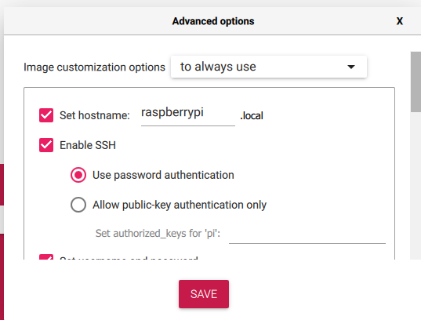
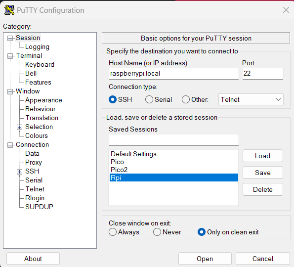
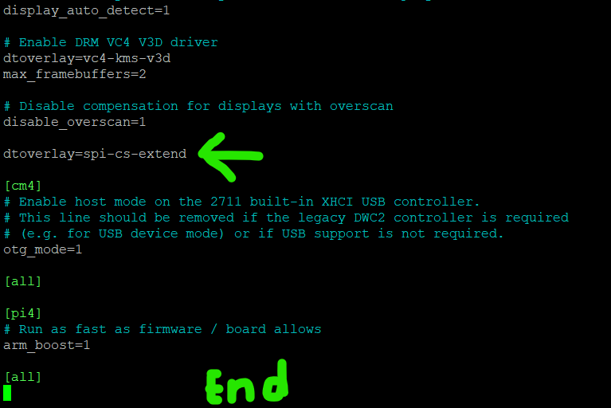

# MilliQan-Experiment-LV-Dist-Calibration
Low-Voltage Distribution board for the MilliQan Experiment with abilities of PMT gain calibration and system emulation.

# Overview
The LV dist board can power up to 80 channels and selectively send pulses to each one. The system is made up of a motherboard and 5 submodules. These submodules are called blade pairs, one of which has a cheap microcontroller on it that communicates with the bases. Each submodule, henceforth blade(s), can control 8 bases with a pair controlling 16. There are 5 blade pairs on the system available.  The pulse will be of length ~ 450ns with variable voltage 0-3.3v in 4095 steps. The board has multiple safety features and overrides. These include replaceable 5x20mm fuses with LED indicators if they are blown, a manual pulse overrides off switch on the motherboard, and an easily replaceable and iterable system of motherboard and blades, which will allow for the system to have continued use with new applications.

The system uses SPI for communication from Raspberry Pi to the Blades. The messages will be detailed below but are a short byte sequence of which channels should be turned on and their respective voltages. The board also uses $I^2C$ communication for all integrated circuit chips on the board. This includes the light sensor ADC, the DAC voltage control on the bases, and a potentiometer. 

# Usage

The system is designed to take in formatted 


# First Time Setup, Raspberry Pi

## Flashing
The easiest way to get started with a Raspberry Pi is to use the [Raspberry Pi imager](https://www.raspberrypi.com/software/) to get the software onto the microsd card.
The standard latest 64 bit version of Raspberry Pi OS can be used. For ease of setup, especially headless ones, define all settings in the bottom right gear icon.




Make sure to enable SSH for headless setup. If a screen will be used, it can be enabled through the GUI.
Same for the internet settings. It should be done here onto a network you are sure you can connect to if headless but can be done later otherwise.


## Get Connected
After the flashing has finished. Plug in the microsd into the slot on the raspberry Pi.
To connect to the Raspberry Pi, either use [Putty](https://www.putty.org/) with the hostname that was defined in the imaging setting like so:



And click open or just click on the terminal icon from the raspberry pi desktop in the top left. This will put you into
the terminal where you can continue the guide exactly as if you had the Pi connected to a keyboard.
Alternatively use a VNC client like [VNC viewer](https://www.realvnc.com/en/connect/download/viewer/) and connect to the 
raspberrypi to see the desktop wirelessly. 
To turn on VNC, see [Enable SPI and I2C](#enable-spi-and-i2c) for how to do this.

## Update
The first steps will be to update and upgrade the system. This is done using the sudo keyword which will run a program
at the administrative level. Run:
```
sudo apt-get update && sudo apt-get upgrade
```
When prompted press y to continue the installation. This will update all common libraries to the newest versions.

## Enable SPI and $I^2C$

To enable both of these and mess with the safe settings on a Raspberry Pi use:
```angular2html
sudo raspi-config
```
Then using the arrow keys go to "3 Interface Options" (so that it is selected red) and click enter.
Then if not already done, enable: SSH, VNC and enable SPI, I2C by going over them and selecting yes when prompted.

## Get Python Virtual Engine

Then we will install project specific libraries. This program utilizes pip modules, which require a virtual python engine to run.

Run:
`sudo apt-get install python3-pip` and `sudo apt install --upgrade python3-setuptools`

Then download the python virtual engine
```angular2html
sudo apt install python3.11-venv
python -m venv env --system-site-packages
```

The virtual environment is a somewhat new requirement so that the global version of python can be used for other means.
In this case it is mostly done so that we don't have error messages when trying to install our libraries.

Then activate it using `source env/bin/activate`. This will allow all python libraries to be stored only in the python
that exists when this is activated.


## Blinka

Note that everything going forward should be done with the venv active.

From here we can download the libraries.
The first of which is [Blinka](https://learn.adafruit.com/circuitpython-on-raspberrypi-linux/installing-circuitpython-on-raspberry-pi). As from their site run one by one
the following 4 commands.

```angular2html
cd ~
pip3 install --upgrade adafruit-python-shell
wget https://raw.githubusercontent.com/adafruit/Raspberry-Pi-Installer-Scripts/master/raspi-blinka.py
sudo -E env PATH=$PATH python3 raspi-blinka.py
```

Then check it has been installed correct with `ls /dev/i2c* /dev/spi*`
If the output is similar to: `/dev/i2c-1   /dev/spidev0.0 /dev/spidev0.1` you are ready to continue on,
if not go to the link and try their troubleshooting.

## Add SPI CS Pins
This system utilizes more than the two default spi chip selects. To add the extra chip selects (5 extra for 7 in total), copy this
repository into the RPi. This is done with 
```
git clone https://github.com/eliottschaffer/MilliQan-Experiment-LV-Dist-Calibration
```

Within the setup folder, a file [spi-cs-extend.dts](/Setup/spi-cs-extend.dts) can we found. This file needs to be 
compiled locally. This spi extender template comes from this [forum](https://gist.github.com/mcbridejc/d060602e892f6879e7bc8b93aa3f85be).

Navigate to the folder with

```angular2html
cd ~/MilliQan-Experiment-LV-Dist-Calibration/Setup
```
and run
```angular2html
dtc -@ -I dts -O dtb -o spi-cs-extend.dtbo spi-cs-extend.dts
```
A new file called spi-cs-extend.dtbo should have been created and can be confirmed with `ls`

This file will then be moved to the boot folder using:

```angular2html
mv spi-cs-extend.dtbo /boot/overlays
```

Then a file needs to editted. 

Run using a text editor (here nano):

```angular2html
sudo nano /boot/config.txt
```

Add the line `dtoverlay=spi-cs-extend` to near the end of the file.
Please be careful here since this is a boot file and could require to start over with a new installation of Raspbian if you delete something important.

It should look like from the bottom of the file:



Then save (in nano using Crtl+X (^X) and then pressing Y to modify the buffer).

To check that everything worked correctly, reboot the raspberry pi using `sudo reboot`

Once reconnected to the Raspberry Pi run `ls /dev/i2c* /dev/spi*` again. 
There should now be more output, specifically terms ranging from /dev/spidev0.0  to /dev/spidev0.6.

## General Libraries

To install the rest of the general libraries. Run:

```angular2html
cd ~/MilliQan-Experiment-LV-Dist-Calibration/Requirements
pip install -r requirements.txt
```

The program should now be ready to run on the raspberry without any errors. 


# First Time Setup, Pico

The pico setup is much less involved unless code needs to be changed.
This is most easily done with Windows of Mac.

Flash the Picos with the code. To do this:

1. While holding down the boot button on the Picos. Plug it using a micro-usb cable into a computer.
2. A writeable drive should have appeared in your file explorer. Download the complied uf2 code [LV_Dist_SPi.uf2](/Source/LV_Dist_Spi.uf2)
3. Drag that uf2 file onto the writeable drive. It should then disappear. This means it has been written correctly.

The Picos should now be ready to use and can be plugged into the Blades.


For creating new Pico firmware, many hoops have to be jumped through to get the C-SDK working. For now (unless I go ahead and make documentation for it), one can take a look at the source code, [main.c](/Source/main.c)
and email me at eliottschaffer@ucsb.edu or eliottschaffer@gmail.com for any concerns.

