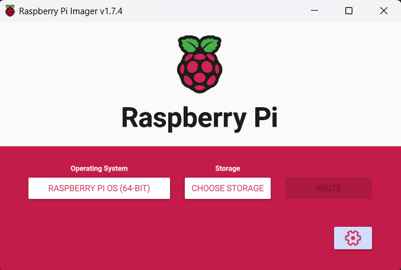

# MilliQan-Experiment-LV-Dist-Calibration
Low-Voltage Distribution board for the MilliQan Experiment with abilities of PMT gain calibration and system emulation.

# Overview
The LV dist board can power up to 80 channels and selectively send pulses to each one. The system is made up of a motherboard and 5 submodules. These submodules are called blade pairs, one of which has a cheap microcontroller on it that communicates with the bases. Each submodule, henceforth blade(s), can control 8 bases with a pair controlling 16. There are 5 blade pairs on the system available.  The pulse will be of length ~ 450ns with variable voltage 0-3.3v in 4095 steps. The board has multiple safety features and overrides. These include replaceable 5x20mm fuses with LED indicators if they are blown, a manual pulse overrides off switch on the motherboard, and an easily replaceable and iterable system of motherboard and blades, which will allow for the system to have continued use with new applications.

The system uses SPI for communication from Raspberry Pi to the Blades. The messages will be detailed below but are a short byte sequence of which channels should be turned on and their respective voltages. The board also uses $I^2C$ communication for all integrated circuit chips on the board. This includes the light sensor ADC, the DAC voltage control on the bases, and a potentiometer. 

# Setup, Raspberry Pi

### Flashing
The easiest way to get started with a Raspberry Pi is to use the [Raspberry Pi imager](https://www.raspberrypi.com/software/) to get the software onto the microsd card.
The standard latest 64 bit version of Raspberry Pi OS can be used. For ease of setup, especially headless ones, define all settings in the bottom right gear icon.



Make sure to enable SSH for headless setup. If a screen will be used, it can be enabled through the GUI.
Same for the internet settings. It should be done here onto a network you are sure you can connect to if headless but can be done later otherwise.


### Get Connected
After the flashing has finished. Plug in the microsd into the slot on the raspberry Pi.
To connect to the Raspberry Pi, either use [Putty](https://www.putty.org/) with the hostname that was defined in the imaging setting like so:


And click open or just click on the terminal icon from the raspberry pi desktop in the top left. This will put you into the terminal where you can continue the guide exactly as if you had the Pi connected to a keyboard.
Alternatively use a VNC client like VNC viewer and connect to the raspberrypi to see the desktop wirelessly.

### Update
The first steps will be to update and upgrade the system. This is done using the sudo keyword which will run a program
at the administrative level. Run:
```
    sudo apt-get update && sudo apt-get upgrade
```
This will update all common libraries to the newest versions.

Then we will install project specific libraries. This program utilizes pip modules, which require a virtual python engine to run.

The first of which is [Blinka](https://learn.adafruit.com/circuitpython-on-raspberrypi-linux/installing-circuitpython-on-raspberry-pi)

Run:
`sudo apt-get install python3-pip` and `sudo apt install --upgrade python3-setuptools`

Then download the virtual engine
```
sudo apt install python3.11-venv
python -m venv env --system-site-packages
```